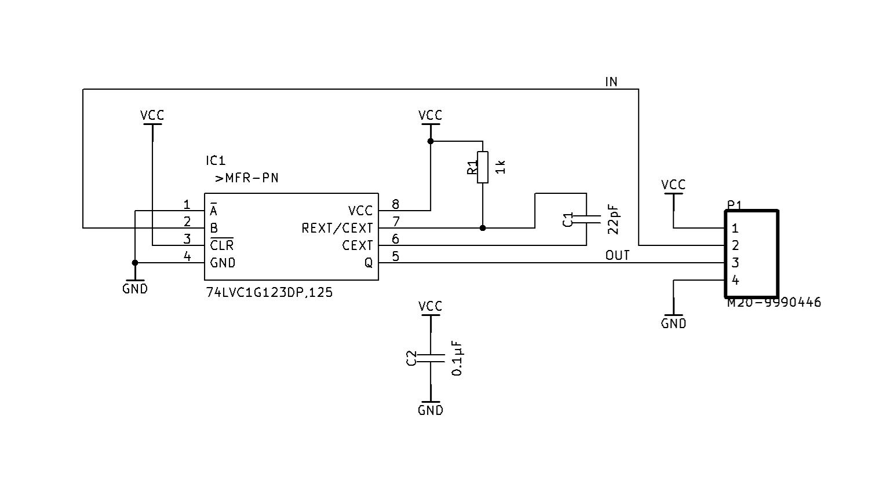

# Duration Extender for Laser Pulse Receiver

## Description

This project is intended for testing the circuit from the repository:  
https://github.com/karu2003/small_projects/tree/master/laser_sound_card

The device increases the duration of the input signal coming from the laser pulse receiver (pulse duration — 3 ns).  
This is necessary for correct processing of the signal by the Raspberry Pi Pico microcontroller using the PIO block.  
Thanks to this, even very short pulses from the laser become long enough to be reliably processed in digital logic.

## Schematic

## Links

- [KiCad](https://github.com/karu2003/small_projects/tree/master/laser_sound_card)
